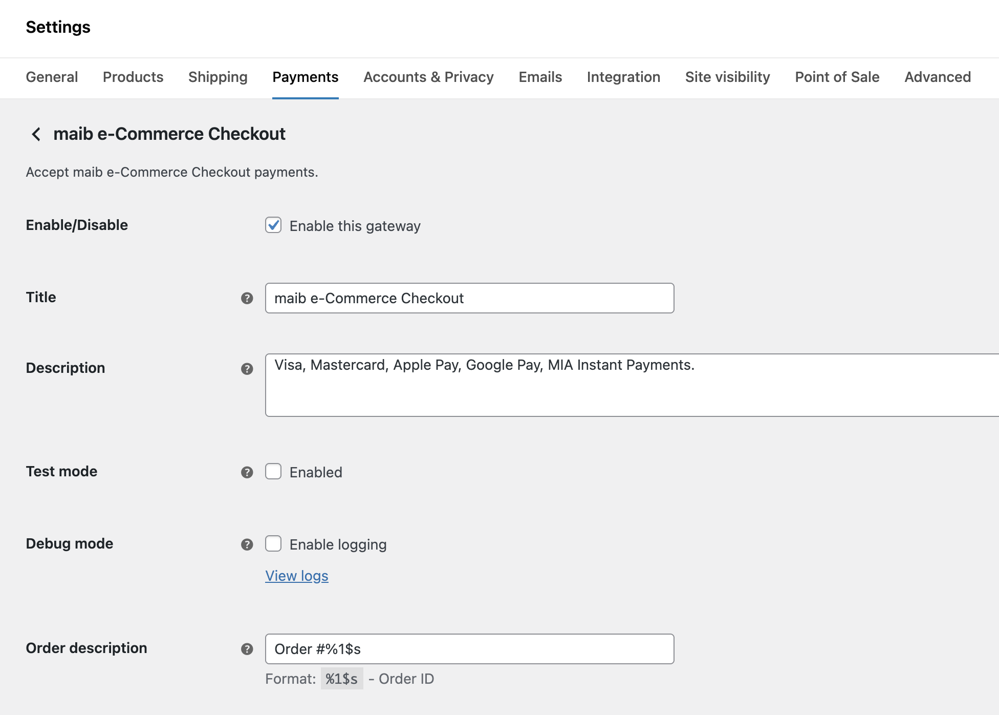
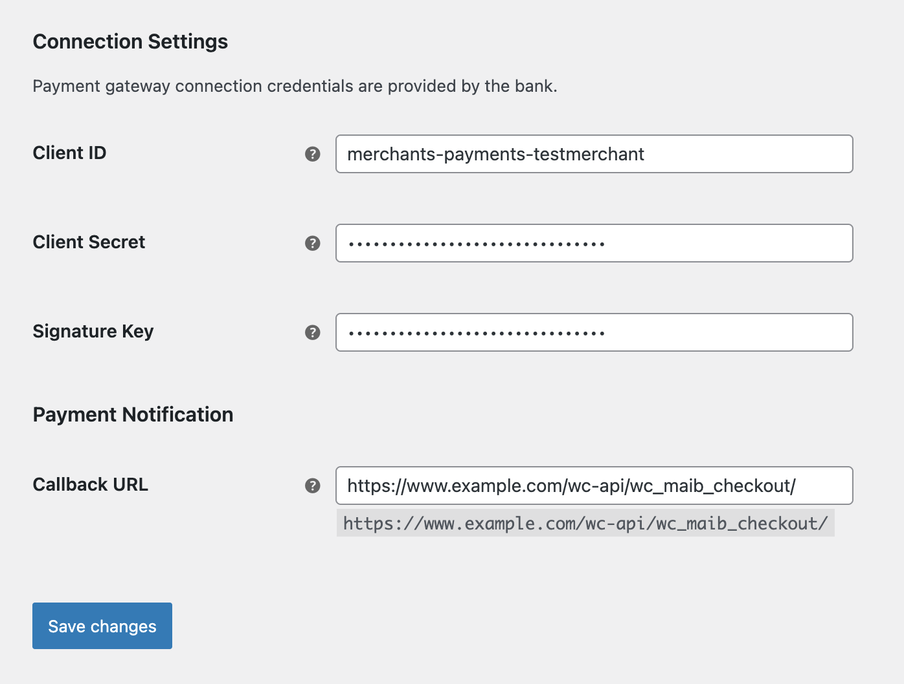
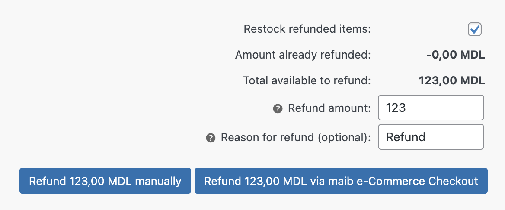
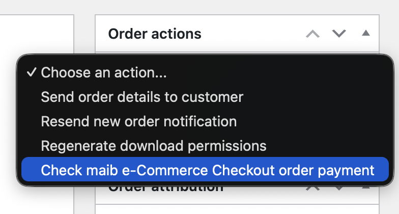

# Payment Gateway for maib e-Commerce Checkout for WooCommerce

_Accept Visa, Mastercard, Apple Pay, Google Pay, MIA Instant Payments directly on your store with the Payment Gateway for maib e-Commerce Checkout for WooCommerce_

WordPress plugin: https://wordpress.org/plugins/payment-gateway-wc-maib-checkout/

## Features

* Online payments with [maib e-Commerce Checkout](https://www.maib.md/en/persoane-juridice/e-commerce)
* Reverse transactions – partial or complete refunds
* Admin order actions – check order payment status
* Supports WooCommerce [block-based checkout experience](https://woocommerce.com/checkout-blocks/)
* Free to use – [Open-source GPL-3.0 license on GitHub](https://github.com/alexminza/payment-gateway-wc-maib-checkout)

## Getting Started

* [maib e-Commerce Checkout](https://www.maib.md/en/persoane-juridice/e-commerce)
* [Installation Instructions](https://wordpress.org/plugins/payment-gateway-wc-maib-checkout/installation/)
* [Frequently Asked Questions](https://wordpress.org/plugins/payment-gateway-wc-maib-checkout/faq/)

## Screenshots

1\. Plugin settings

2\. Connection settings

3\. Refunds

4\. Order actions

